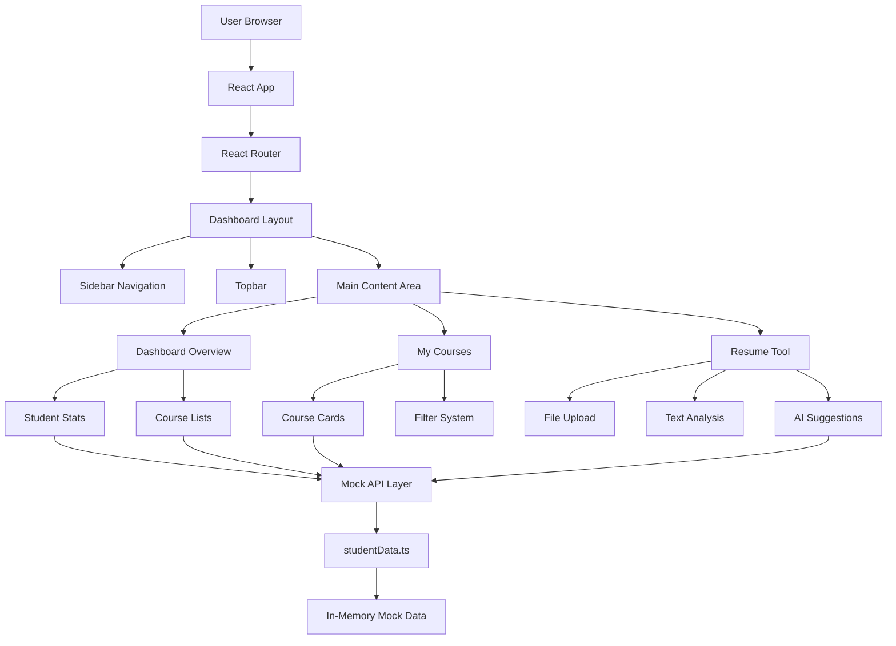
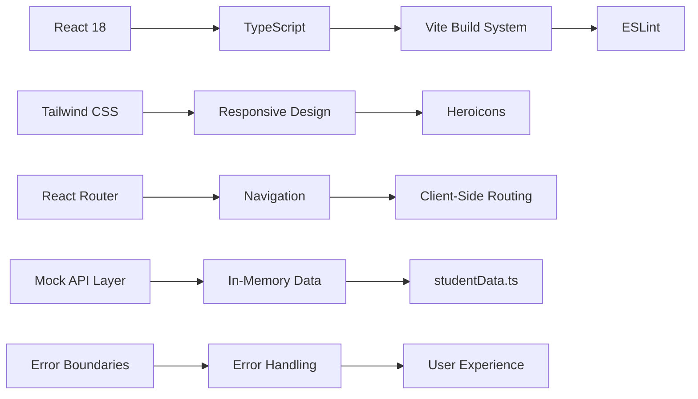
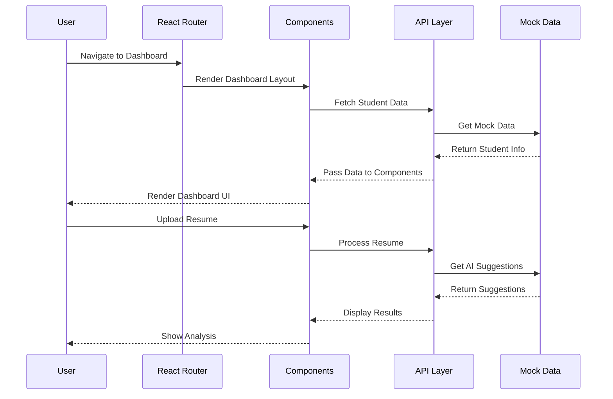
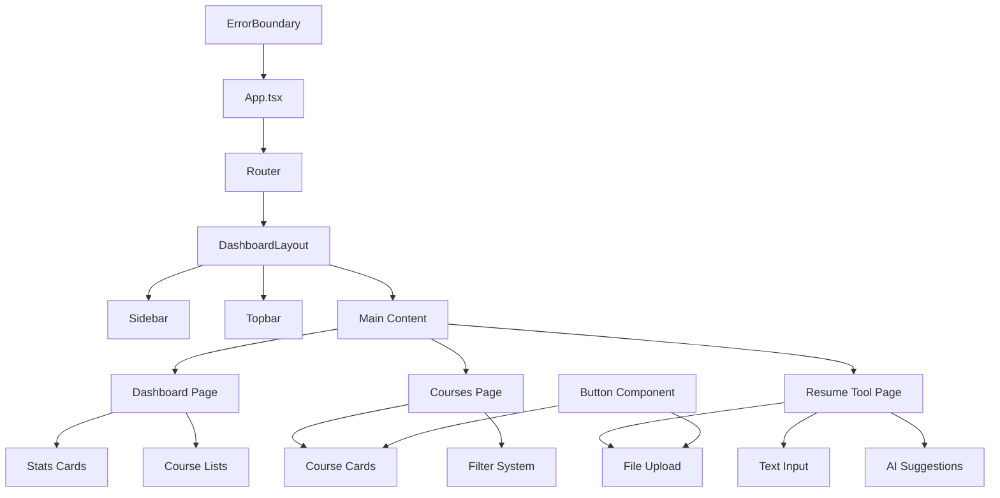
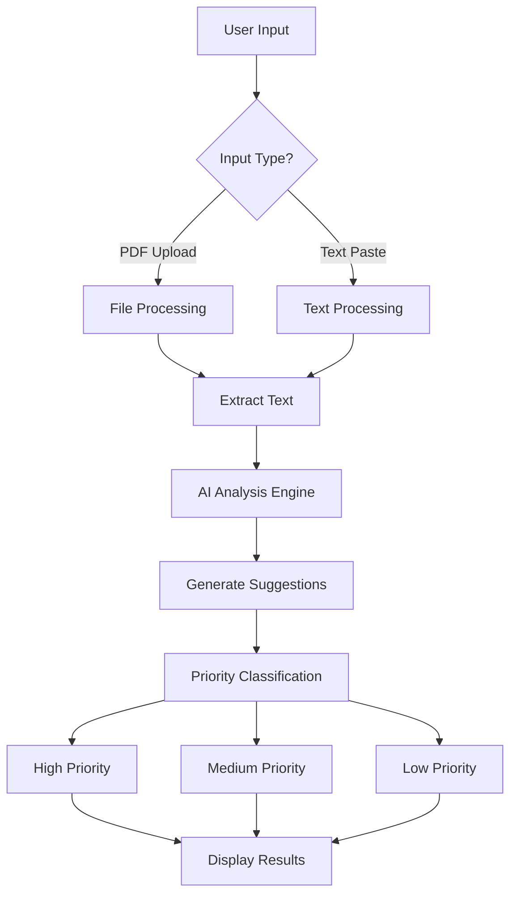

# Student Dashboard - Online EdTech Portal 🚀

A modern React-based student dashboard for an online education platform, built with TypeScript, Tailwind CSS, and React Router.

## 🧠 Architecture Overview



## 🎯 Core Features

### 🎓 Dashboard Overview

- **Student Profile & Progress Tracking**: Real-time stats that make you feel like a data scientist
- **Course Completion Statistics**: Because numbers are cool, right? 📊
- **Active & Completed Course Lists**: Track your learning journey with beautiful course cards
- **Responsive Design**: Works on everything from your grandma's iPad to your gaming rig

### 📚 My Courses

- **Smart Course Filtering**: Filter by status (Active, Completed, Upcoming) - because organization is key 🔑
- **Progress Visualization**: Beautiful progress bars that actually mean something
- **Course Status Indicators**: Color-coded because we're not savages
- **Instructor Details**: Know who's teaching you that sweet, sweet knowledge

### ✨ AI Resume Tool

- **PDF Upload Support**: Because who still uses Word docs? 🤷‍♂️
- **Text Analysis Engine**: Paste your resume and watch the magic happen
- **Priority-Based Suggestions**: High, medium, low priority - like a real-life task manager
- **Real-Time Processing**: No waiting around like it's 1999

## 🛠️ Tech Stack Deep Dive



### Frontend Architecture

- **React 18**: Because hooks are life, and concurrent features are the future
- **TypeScript**: Because `any` is not a type, and we're not animals
- **React Router v6**: For that sweet, sweet client-side routing
- **Tailwind CSS**: Utility-first CSS that actually makes sense

### Development Tools

- **Vite**: Lightning-fast builds because waiting is so 2020
- **ESLint**: Code linting that actually works
- **TypeScript**: Because runtime errors are for the weak
- **Tailwind CSS**: Because writing custom CSS is so 2010

## 🚀 Getting Started

### Prerequisites

- **Node.js** (v16 or higher) - because we're not living in the past
- **npm** or **yarn** - package managers that don't suck

### Installation & Setup

1. **Clone the repository** (because git is awesome):

```bash
git clone <repository-url>
cd student-dashboard
```

2. **Install dependencies** (this might take a minute):

```bash
npm install
```

3. **Start the development server** (and watch the magic happen):

```bash
npm run dev
```

4. **Open your browser** and navigate to `http://localhost:5173` - because localhost is where the magic happens ✨

### Available Scripts

| Command           | What it does              | Why you care             |
| ----------------- | ------------------------- | ------------------------ |
| `npm run dev`     | Starts development server | Hot reloading is life    |
| `npm run build`   | Builds for production     | Because we ship code     |
| `npm run preview` | Previews production build | Test before you deploy   |
| `npm run lint`    | Runs ESLint               | Clean code is happy code |

## 📁 Project Structure

```
src/
├── api/
│   └── studentData.ts          # Mock data and API service
├── features/
│   └── dashboard/
│       ├── components/
│       │   └── Layout/         # Dashboard layout components
│       └── pages/              # Dashboard pages
├── components/                  # Reusable components
└── router.tsx                  # Application routing
```

## 🔄 Data Flow Architecture



## 🎨 Component Architecture



## 🧪 Mock Data Structure

The application uses sophisticated in-memory mock data to simulate a real backend (because we're not backend developers, we're frontend heroes):

### Student Profile Schema

```typescript
interface Student {
  id: string;
  name: string;
  email: string;
  avatar: string;
  totalCourses: number;
  completedCourses: number;
  currentCourses: number;
}
```

### Course Data Schema

```typescript
interface Course {
  id: string;
  title: string;
  instructor: string;
  status: "active" | "completed" | "upcoming";
  progress: number;
  totalLessons: number;
  completedLessons: number;
  category: string;
  image: string;
  description: string;
  startDate: string;
  endDate: string;
}
```

## 🤖 AI Resume Analysis Flow



## 🚀 Performance Optimizations

- **React.memo()**: Because unnecessary re-renders are the enemy
- **Responsive Design**: Custom breakpoints for optimal mobile experience
- **CSS Transforms**: Smooth mobile sidebar animations
- **Error Boundaries**: Graceful error handling FTW
- **Text Truncation**: Prevents overflow on smaller screens

## 🎨 Responsive Design Features

- **Mobile-First Approach**: Optimized for all screen sizes
- **Custom Breakpoints**: Handles edge cases (1024px-1107px)
- **Flexible Grid System**: Adapts from 1 to 4 columns
- **Smooth Animations**: 300ms transitions for mobile sidebar
- **Touch-Friendly**: Proper spacing and sizing for mobile

## 🐛 Debugging Tips

1. **Check the Console**: Because console.log is still the best debugger
2. **React DevTools**: Install it, love it, live it
3. **Network Tab**: See what's happening with your API calls
4. **TypeScript Errors**: Read them, fix them, embrace them

## 🤝 Contributing

1. **Fork the repository** (because collaboration is key)
2. **Create a feature branch** (git flow for the win)
3. **Make your changes** (and make them awesome)
4. **Add tests** (because untested code is broken code)
5. **Submit a pull request** (and hope for the best)

## 📄 License

This project is licensed under the MIT License - because open source is the future.

## 🖼️ Screenshots

_Screenshots will be added here showing the dashboard interface_

---

Built with ❤️ and copious amounts of ☕ for the EdTech community

*"In a world full of bugs, be the feature that works."* 🐛✨