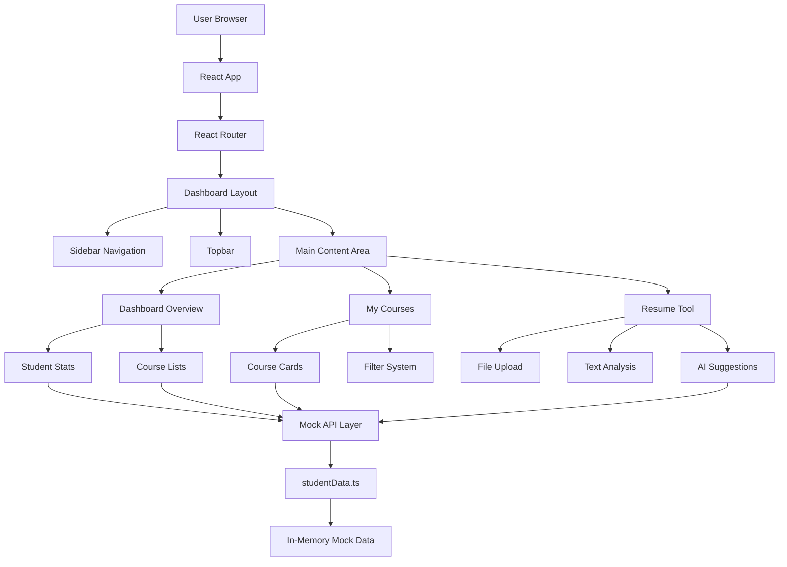
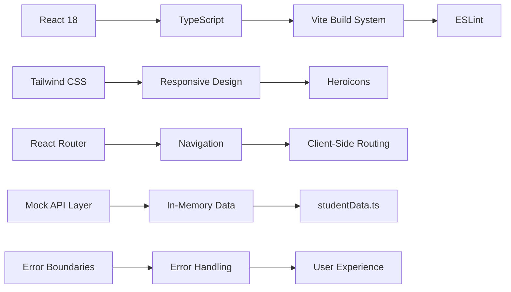
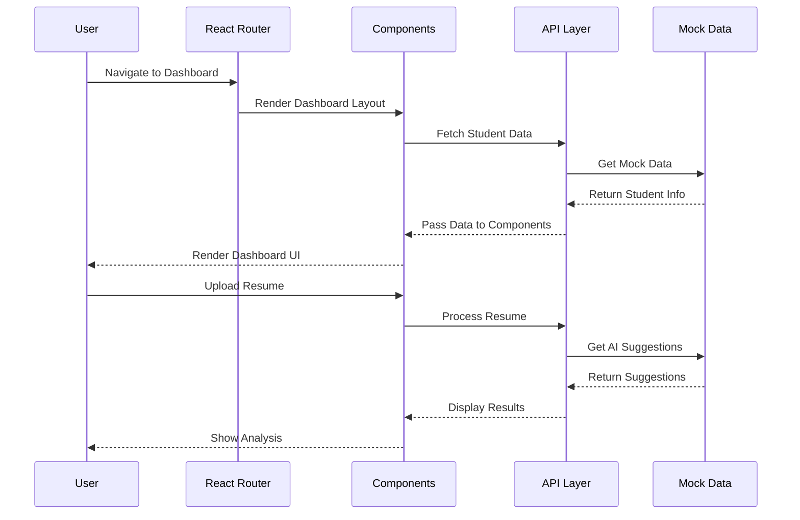

# Student Dashboard - Online EdTech Portal 🚀

A modern React-based student dashboard for an online education platform, built with TypeScript, Tailwind CSS, React Router, and **Axios** for API simulation.

Live page: https://olliekse.github.io/student-dashboard/

## 🧠 Architecture Overview



## 🎯 Core Features

### 🎓 Dashboard Overview

- **Student Profile & Progress Tracking**
- **Course Completion Statistics**
- **Active & Completed Course Lists**
- **Responsive Design**

### 📚 My Courses

- **Smart Course Filtering**
- **Progress Visualization**
- **Course Status Indicators**
- **Instructor Details**

### ✨ AI Resume Tool

- **PDF Upload Support**
- **Text Analysis Engine**
- **Priority-Based Suggestions**
- **Real-Time Processing**

### 🛰️ API Simulation

- **All data fetching is performed asynchronously using [Axios](https://axios-http.com/)**
- **Mock API endpoints are simulated in-memory**
- **Network latency is simulated for realistic UX**

## 🛠️ Tech Stack Deep Dive



### Frontend Architecture

- **React 18**
- **TypeScript**
- **React Router v6**
- **Tailwind CSS**
- **Axios**

### Development Tools

- **Vite**
- **ESLint**

## 🚀 Getting Started

### Prerequisites

- **Node.js** (v16 or higher)
- **npm** or **yarn**

### Installation & Setup

1. **Clone the repository**:

```bash
git clone <repository-url>
cd student-dashboard
```

2. **Install dependencies**:

```bash
npm install
```

3. **Start the development server**:

```bash
npm run dev
```

4. **Open your browser** and navigate to http://localhost:5173/student-dashboard/

### Available Scripts

| Command         | What it does              | Why you care             |
| --------------- | ------------------------- | ------------------------ |
| npm run dev     | Starts development server | Hot reloading is life    |
| npm run build   | Builds for production     | Because we ship code     |
| npm run preview | Previews production build | Test before you deploy   |
| npm run lint    | Runs ESLint               | Clean code is happy code |

## 📁 Project Structure

```
src/
├── api/
│   └── studentData.ts          # Mock data and API service
├── features/
│   └── dashboard/
│       ├── components/
│       │   └── Layout/         # Dashboard layout components
│       └── pages/              # Dashboard pages
├── components/                 # Reusable components
└── router.tsx                  # Application routing
```

## 🔄 Data Flow Architecture



## 🤖 Mock API & Data Structure

### Example

```ts
// Fetch all courses
const courses = await axios.get("/mock/courses");
```

### Student Profile Schema

```ts
interface Student {
  id: string;
  name: string;
  email: string;
  avatar: string;
  totalCourses: number;
  completedCourses: number;
  currentCourses: number;
}
```

### Course Data Schema

```ts
interface Course {
  id: string;
  title: string;
  instructor: string;
  status: "active" | "completed" | "upcoming";
  progress: number;
  totalLessons: number;
  completedLessons: number;
  category: string;
  image: string;
  description: string;
  startDate: string;
  endDate: string;
}
```

## 🚀 Performance Optimizations

- **React.memo()** to prevent unnecessary re-renders
- **useCallback()** to memoize event handlers
- **Responsive Design**
- **CSS Transforms** for smooth effects
- **Error Boundaries**
- **Text Truncation** for clean UI

## 🎨 Responsive Design Features

- **Mobile-First Approach**
- **Custom Breakpoints**
- **Flexible Grid System**
- **Smooth Animations**
- **Touch-Friendly**

## 🐛 Debugging Tips

1. **Check the Console**
2. **React DevTools**
3. **Network Tab** (see Axios requests)
4. **TypeScript Errors**

## 🤝 Contributing

1. **Fork the repository**
2. **Create a feature branch**
3. **Make your changes**
4. **Add tests**
5. **Submit a pull request**

## 📄 License

This project is licensed under the MIT License.

## 🖼️ Screenshots


---

## 🚨 Important: Tailwind CSS Version Locked

This project uses **Tailwind CSS v3.4.1**. Do not upgrade to v4+ unless you update the PostCSS configuration and related dependencies.
